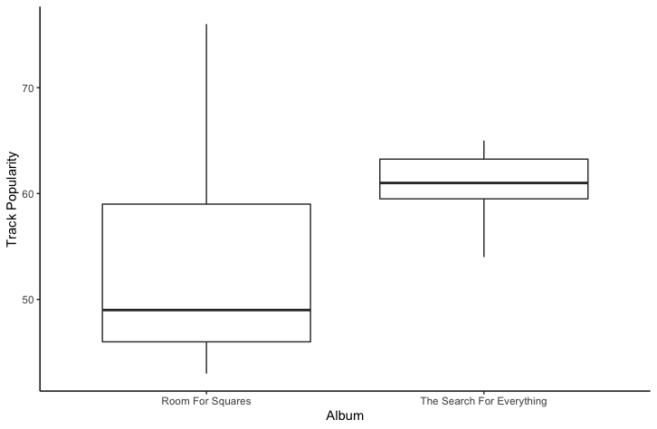

# CMPortfolio
Portfolio for Computational Musicology

With all the data of the tables with the audio features and the summarise function, I found the mean, standard deviation and calculated the mean -/+ the standard deviation for multiple features of two albums. The two albums I chose are Room For Squares, which is one of the first albums of John Mayer, and The Search For Everything, which is the most recent album of John Mayer. I chose these two albums to be able to compare the popularity of the songs on both of the albums. Some distinctive features which I found here are the energy and the track popularity. The energy seems to be higher for the Room For Squares album, but the track popularity seems to be higher for the The Search For Everything album. 

The next thing I did was make boxplots in r. What can be seen very clearly here is that the track popularity seems to be higher for the most recent album, but it also shows that the range here is much narrower compared to the Room For Squares album. 

 
This scatterplot clearly shows the track popularity, the valence, the loudness and the mode of the tracks. The track popularity is shown on the Y-axis, the X-axis shows the valence, the color of the dots shows the mode and the size of the dots show the loudness. One important thing here is that I labeled one song of each album with the highest track popularity. What is very noticeable here, as well as in the boxplot, is that the range of the track popularity of the most recent album is much narrower compared to the other album. What is also easily noticeable is that the first album has a much bigger outlier compared to the second album. However, even with these visuals, it remains hard to find a real connection between the popularity, the valence, the mode or the loudness.

